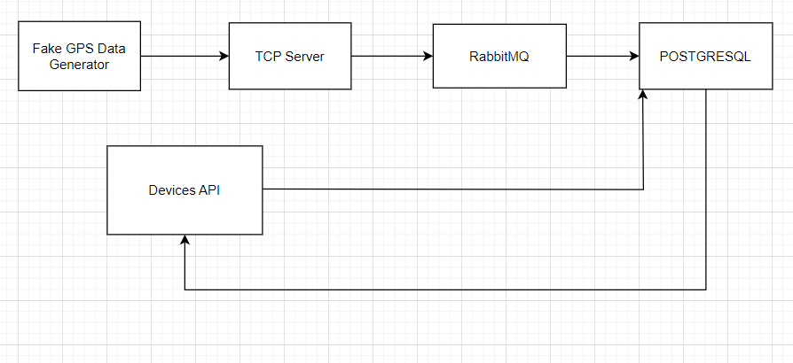

# GPS Devices Rest API

This API facilitates the management of GPS devices, offering functionalities for addition, updating, deletion, and retrieval operations. Implemented within the framework of Clean Architecture with Dependency Injection in FastAPI, the application seamlessly integrates RabbitMQ as a message broker and PostgreSQL as the underlying database. Moreover, TCP Socket communication is leveraged for efficient data exchange. Soft deletion is implemented, adhering to the deletion pattern for enhanced data management.

# Features
- Fake GPS devices are generated using Faker.
- Transfer fake data with TCP Socket.
- Consume data from RabbitMQ.
- Write data to PostgreSQL.

## Features of Devices API:
- Add device
- List devices
- Get device locations
- Get last locations of all devices
- Delete device

## Tech stack
- Python
- FastAPI
- TCP Socket
- RabbitMQ
- SQLAlchemy
- PostgreSQL
- Docker
- Docker Compose
- Poetry

## Prerequisites
- Docker
- Make
- Docker Compose

## API Architecture
Directory structure based on [Clean Architecture](https://blog.cleancoder.com/uncle-bob/2012/08/13/the-clean-architecture.html)

## Installation
- make build-dev
- make up

## Usage
- http://localhost:8000/api/v1/gps-devices  GET
- http://localhost:8000/api/v1/gps-devices/{device_id}  GET
- http://localhost:8000/api/v1/gps-devices  POST  payload = {"name": "example"}
- http://localhost:8000/api/v1/gps-devices/{device_id}/last-locations  GET
- http://localhost:8000/api/v1/gps-devices/{device_id}  DELETE

# DOCS
- http://localhost:8000/docs
- http://localhost:8000/redoc

## What features could be improved?
- Error handling
- Logging
- Caching
- Testing
- Pagination
- Authentication
- Authorization

